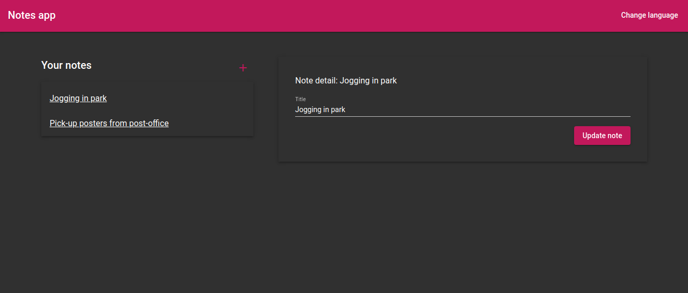

# Notes application

This project is Angular version of this app [bsc-homework](https://github.com/captain-refactor/bsc-homework).

## How to run
Because of the i18n building, I created basic server in NodeJs to serve multiple locales.

 - run `npm i`
 - run `npm test`
 - run `npm run build`
 - run `npm run start`
 - open browser at `localhost:8080`

## Screenshot

